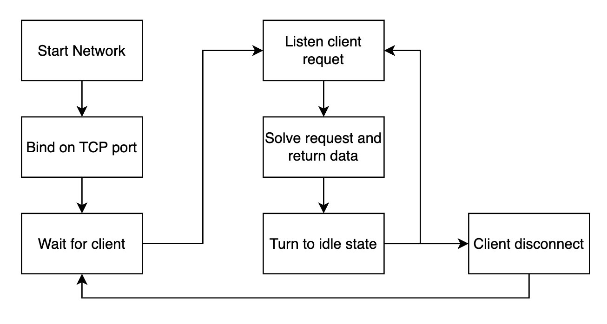
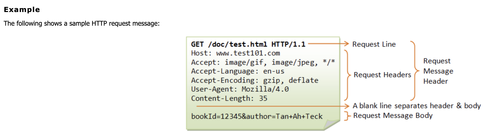
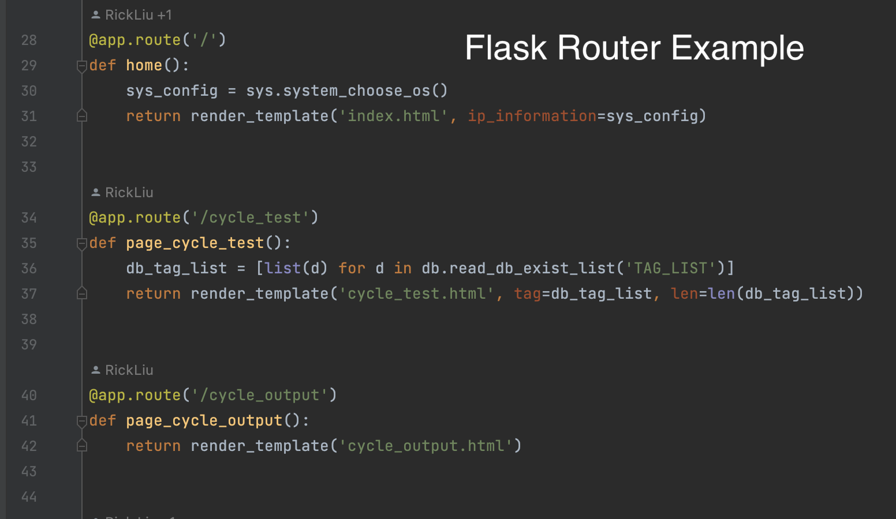
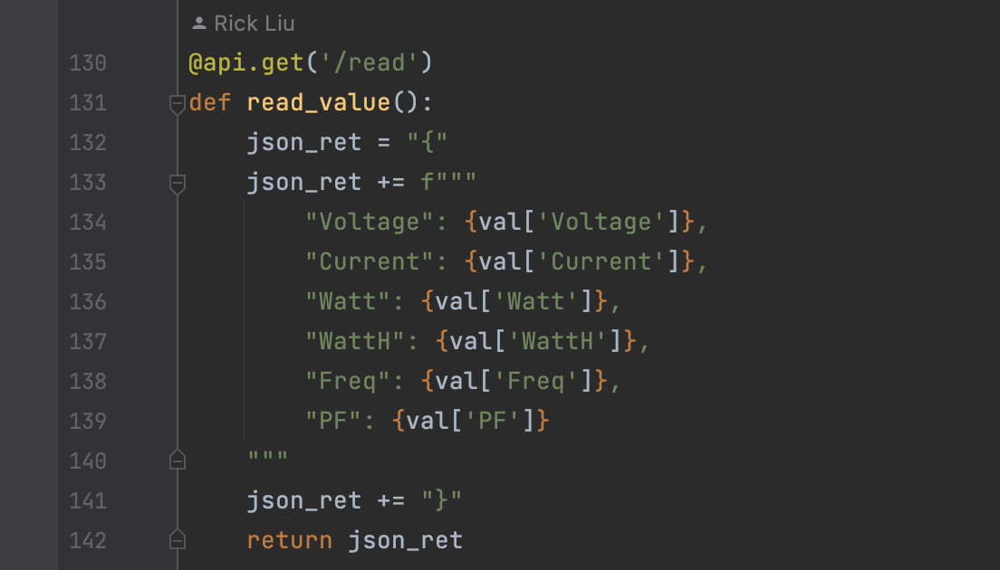

# Build a simple API server
## Step1: Design Concept

## Step2: Request Format
* Refer to [# HTTP (HyperText Transfer Protocol) Basics](https://www3.ntu.edu.sg/home/ehchua/programming/webprogramming/http_basics.html)

## Step3: Start Coding
* Refer to Flask how to setup get/pot url concept
 
* Using decorator to filter request url and function
 
 
## Step4: Result
* Using [Postman](https://www.postman.com) to check working correctly

# [Go Back to Readme](../README.md)
