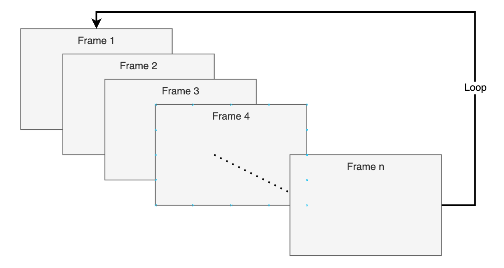
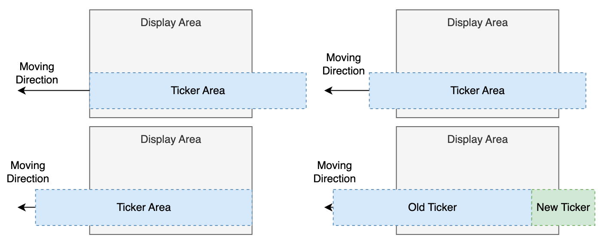
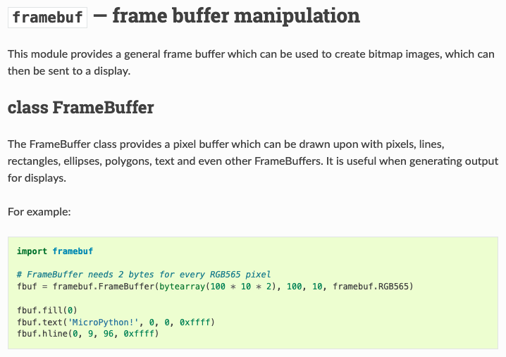
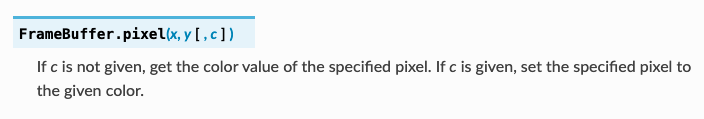

# Animation and Information Ticker
## 1. Idea Concept
* Animation: Update frames frequently(PUSH PICO TO LIMIT!)

* Ticker: Save all string in buffer, only show necessary pixel

## 2. Use Tool
* [framebuf](https://docs.micropython.org/en/latest/library/framebuf.html) Library in Micropython

* Update pixel by pixel

## 3. Limitation
* Frame fresh rate limit by SPI bus speed
* Set SPI baud-rate 20000000, max frame rate 2 frames per second
* Ticker pixel array exceed pico buffer limit
* Change strategy: Slice string then change to pixel array 
## 4. Result

*Put some image here*

# [Go Back to Readme](../README.md)
