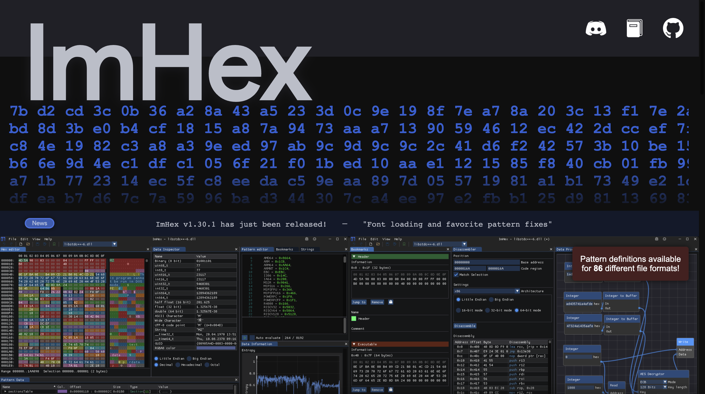

# # How to Read Bitmap image and show on LCD
## Step1: Choose Tool
* Use imhex to show image in hex code: [Official Website](https://imhex.werwolv.net)

* Use Photo Pea to edit image and export as .bmp file: [Photopea](https://www.photopea.com)

## Step2: Decode BMP
* Refer to [BMP File Format Document](http://www.ece.ualberta.ca/~elliott/ee552/studentAppNotes/2003_w/misc/bmp_file_format/bmp_file_format.htm)
*  Split Header and Pixel Data
*  Because this image only have 3 kinds color, mark then 0x01: White, 0x00: Black, 0x03: Yellow

 * Confirm data and image related direction

## Step3: Show on LCD
* Turn into buffer in code

* Done!

# [Go Back](../README.md)
