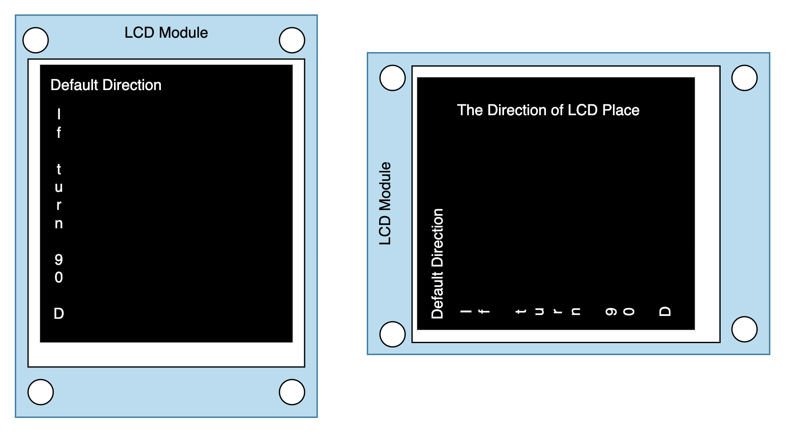
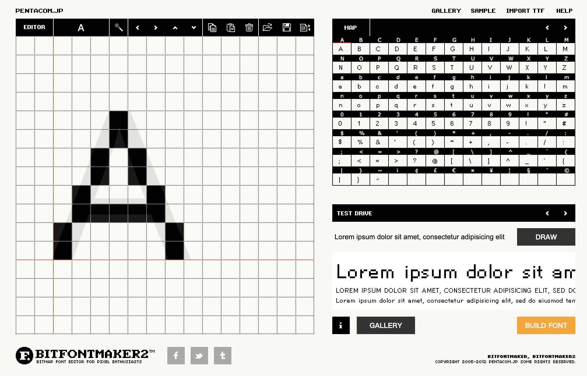
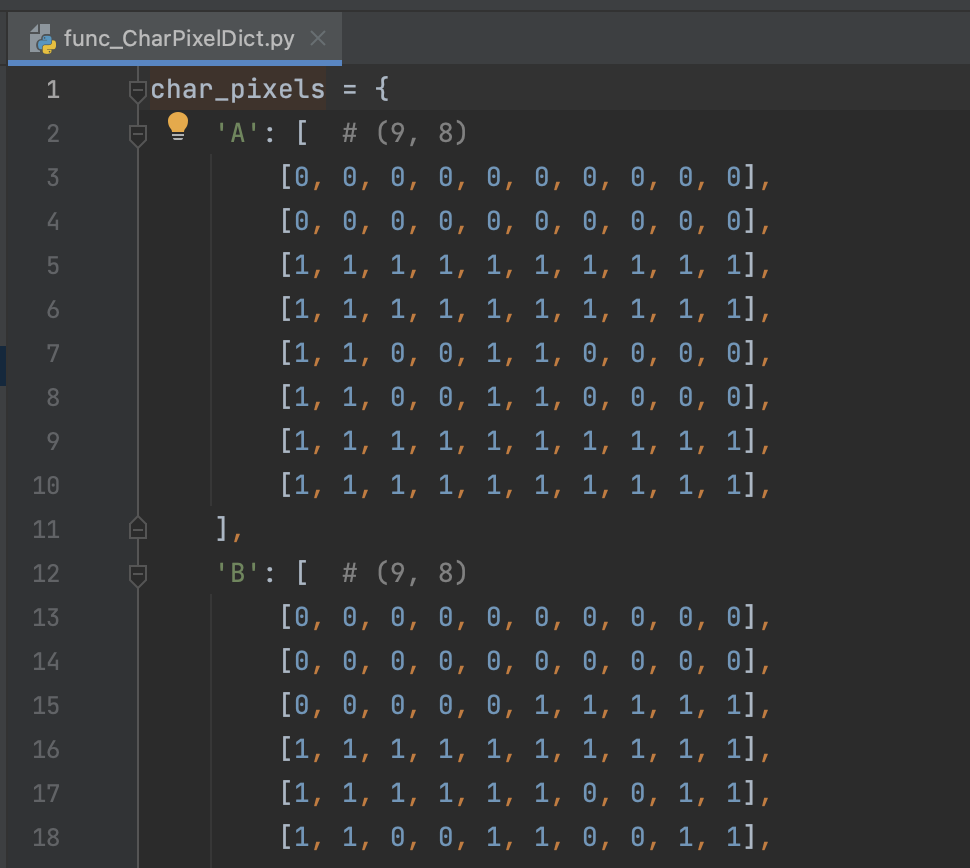
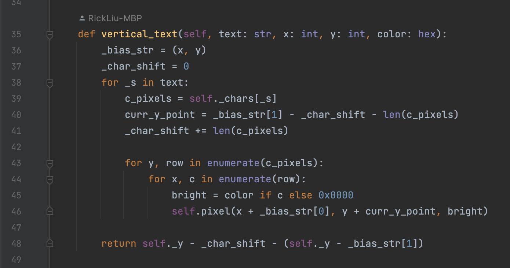
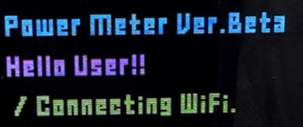

# Turn LCD 90 Degree
## 1. Why need turn 90 Degree
* Default LCD Module is showing vertically
* If try to show in horizontally, text character still vertical

## 2. Build 90 degree text font
* Use [BitFontMaker2](https://www.pentacom.jp/pentacom/bitfontmaker2/)

* Set Height 10 pixel and width 8 pixel, character add 2 pixel margin space
* Turning into list and save into char_pixels dictionary

* Add function in Vertical_LCD class, can select by char and setting x, y position and character color

## 3. Test and Result
* Et voila!

# [Go Back to Readme](../README.md)